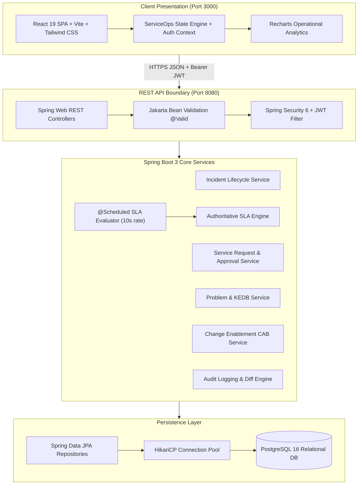

# ServiceOps — ITIL Service Management & Support Platform

> A production-grade IT Service Management (ITSM) web platform inspired by ITIL v4 practices, engineered with a clean architecture across React 19, TypeScript, Java 21 / Spring Boot 3, and PostgreSQL.

[]()
[]()
[]()
[]()
[]()
[]()
[](LICENSE)

---

## 1. Project Overview
ServiceOps is an internal IT Service Management and enterprise support platform designed to streamline how organizations handle technology disruptions, fulfill hardware/software requests, monitor service level agreements (SLAs), and control infrastructure changes.

Unlike superficial CRUD demos, ServiceOps implements **real ITIL lifecycle state machines**, an **authoritative server-side SLA engine**, a **deterministic Impact $\times$ Urgency priority matrix**, **multi-tier approval hierarchies**, and **optimistic concurrency locking**.

---

## 2. Problem Statement
Internal IT support in growing organizations frequently suffers from:
1. **Uncalibrated Urgency**: Users mark non-critical requests as "emergency", overwhelming service desks.
2. **SLA Drift**: Service targets calculated on the client side without background validation lead to unpenalized breaches.
3. **Lost Concurrency Updates**: Multiple agents triaging the same incident overwrite each other's status transitions and handoff notes.
4. **Disjointed Knowledge**: Workarounds discovered during incident resolution fail to reach the Known Error Database (KEDB).

ServiceOps solves these challenges by enforcing ITIL v4 standards through strict relational constraints, background verification, and role-based operational workflows.

---

## 3. Technology Stack

### Frontend
- **Framework**: React 19 SPA (Functional components, hooks, typed context)
- **Language**: TypeScript 5.7+
- **Build Tool**: Vite 8
- **Styling**: Tailwind CSS v4 with custom enterprise design tokens
- **Data Visualization**: Recharts (Operational queue distribution, 7-day SLA trends, agent workload)
- **Icons**: Lucide React

### Backend
- **Platform**: Java 21 (LTS)
- **Framework**: Spring Boot 3.3.3
- **Security**: Spring Security 6, stateless HMAC-SHA256 JWT filter, BCrypt password hashing
- **Persistence**: Spring Data JPA / Hibernate 6, HikariCP connection pooling
- **Validation**: Jakarta Bean Validation (`@Valid`, custom constraints)
- **Documentation**: OpenAPI 3.0 / Swagger UI (`springdoc-openapi`)

### Database & Infrastructure
- **Database**: PostgreSQL 16 (3NF normalized relational schema, indexes, foreign keys)
- **Containerization**: Docker & Docker Compose (Multi-stage build pipelines, non-root user execution, container health checks)

---

## 4. Key Modules & Features

| Module | Features |
| :--- | :--- |
| **Incident Management** | Full lifecycle (`NEW` &rarr; `ASSIGNED` &rarr; `IN_PROGRESS` &rarr; `PENDING` &rarr; `RESOLVED` &rarr; `CLOSED`), intake sources (`PORTAL`, `EMAIL`, `MONITORING`), asset linkage, mandatory resolution notes. |
| **Priority Matrix** | Deterministic calculation: `Impact (HIGH/MED/LOW)` $\times$ `Urgency (HIGH/MED/LOW)` &rarr; `Priority (P1/P2/P3/P4)`. Prevents arbitrary severity inflation. |
| **Authoritative SLA Engine** | Background scheduled task evaluates open tickets every 10s. Tracks `response_deadline`, `resolution_deadline`, elapsed minutes, pause states (`PENDING`), and flags `AT_RISK` (&lt;25% remaining) and `BREACHED`. |
| **Service Catalog** | Categorized hardware, software, and access items with dynamic forms, fulfillment hour estimates, and multi-tier manager approvals. |
| **Approvals Queue** | Dedicated workflow interface for Service Managers and Admins to approve/reject service requests and CAB normal changes with mandatory justification comments. |
| **Problem Management** | Group recurring incidents under a single problem record; root cause analysis (RCA) documentation; Known Error Database (KEDB) publication. |
| **Change Control (CAB)** | Request for Change (RFC) governance with risk assessment, implementation plans, rollback safety procedures, and CAB authorization. |
| **Knowledge Base (KCS)** | Searchable Markdown troubleshooting runbooks, category filtering, view counter, and helpfulness voting. |
| **CMDB Asset Inventory** | Hardware and software Configuration Item (CI) registry tracking asset tags, serial numbers, warranty dates, assigned users, and active incident associations. |
| **Audit Logging** | Append-only event history capturing actors, transitions, timestamps, and field diffs. |

---

## 5. System Architecture



---

## 6. Repository Structure

```
serviceops/
├── backend/
│   ├── src/
│   │   ├── main/java/com/serviceops/
│   │   │   ├── config/          # Spring Security, OpenAPI Swagger, CORS
│   │   │   ├── controller/      # REST Endpoints (Clean controllers, no business logic)
│   │   │   ├── dto/             # Immutable Request & Response record DTOs
│   │   │   ├── entity/          # JPA entities with @Version optimistic locking
│   │   │   ├── exception/       # @RestControllerAdvice centralized error handling
│   │   │   ├── mapper/          # Entity to DTO transformation
│   │   │   ├── repository/      # Spring Data JPA repositories with JPQL
│   │   │   ├── security/        # JWT Token Provider, UserPrincipal, AuthFilter
│   │   │   └── service/         # Domain business logic, SLA engine, workflows
│   │   └── main/resources/      # application.yml configuration
│   ├── src/test/java/           # JUnit 5 & Mockito integration test suites
│   ├── pom.xml                  # Maven dependencies (Java 21, Spring Boot 3.3.3)
│   └── Dockerfile               # Multi-stage JDK builder + JRE runtime
├── database/
│   ├── schema.sql               # 3NF PostgreSQL DDL schema with indexes
│   └── seed.sql                 # Certified ITIL demo dataset & BCrypt hashes
├── docs/
│   ├── architecture.md          # Architectural specifications & Mermaid diagrams
│   ├── database-design.md       # Relational schema ERD and indexing strategy
│   ├── api.md                   # OpenAPI REST endpoint specifications
│   ├── workflows.md             # ITIL lifecycle state machines & SLA matrices
│   └── decisions.md             # Architecture Decision Records (ADRs)
├── src/                         # React 19 TypeScript frontend application
├── docker-compose.yml           # Multi-container orchestration (DB, API, Frontend)
├── Dockerfile.frontend          # Nginx Alpine production frontend container
├── nginx.conf                   # Nginx reverse proxy configuration
├── .env.example                 # Environment configuration template
└── README.md                    # Project documentation
```

---

## 7. Demo Accounts & Credentials

All demo accounts use the standard password: **`Demo123!`**

| Name | Role | Email | Responsibilities |
| :--- | :--- | :--- | :--- |
| **Sarah Chen** | `EMPLOYEE` | `employee@serviceops.local` | Report issues, order hardware, review knowledge guides, confirm resolutions. |
| **Marcus Vance** | `SERVICE_AGENT` | `agent@serviceops.local` | Triage incoming queues, author internal work notes, diagnose problems. |
| **Elena Rostova** | `SERVICE_MANAGER` | `manager@serviceops.local` | Review SLA metrics, authorize catalog requests, approve CAB changes. |
| **David Kim** | `ADMIN` | `admin@serviceops.local` | Configure SLA policy parameters, manage system users and CMDB assets. |

> *Tip: The web interface includes a 1-click persona switcher in the top navigation bar to test role-based permissions without retyping credentials.*

---

## 8. Quickstart with Docker Compose

### Prerequisites
- Docker Engine $\ge 24.0$
- Docker Compose v2

### Steps
```bash
# 1. Clone the repository
git clone https://github.com/example/serviceops.git
cd serviceops

# 2. Configure environment variables
cp .env.example .env

# 3. Start PostgreSQL, Backend, and Frontend containers
docker compose up --build -d

# 4. Verify running health checks
docker compose ps
```

Once running:
- **Web Application**: `http://localhost:3000`
- **Spring Boot REST API**: `http://localhost:8080/api`
- **Swagger OpenAPI Docs**: `http://localhost:8080/swagger-ui.html`
- **Actuator Health Endpoint**: `http://localhost:8080/actuator/health`

---

## 9. Running Tests

### Backend Unit & Integration Tests (JUnit 5 + Mockito)
```bash
cd backend
mvn test
```
Test suites cover:
- Priority matrix verification under all 9 impact/urgency combinations.
- Authoritative SLA deadline computation and automatic breach flagging.
- Incident lifecycle transitions, mandatory resolution notes, and role-based work note authoring.
- MockMvc REST API integration tests.

### Frontend Typecheck & Build
```bash
npm run lint
npm run build
```

---

## 10. Technical Interview Defensibility (Q&A)

### Q1: Why was PostgreSQL chosen instead of MongoDB or another NoSQL database?
**Answer**: ITSM is fundamentally relational. An incident has strict relationships to a requester, an assigned agent, an asset in the CMDB, an SLA policy, comments, and audit entries. ACID guarantees are critical to ensure that ticket sequences remain strictly unique under concurrency, and that status transitions, SLA milestone timestamps, and audit events commit atomically within a single database transaction.

### Q2: How does the SLA tracking engine prevent client-side clock tampering?
**Answer**: SLA deadlines (`response_deadline`, `resolution_deadline`) are calculated strictly on the backend using authoritative UTC server time at ticket creation. A scheduled background worker (`@Scheduled`) evaluates open tickets, marks breaches, and flags `AT_RISK` status when remaining time drops below 25%. The frontend renders countdowns relative to server timestamps.

### Q3: What prevents two agents from overwriting each other's changes concurrently?
**Answer**: Optimistic Locking is implemented via a `@Version private Long version;` field on the `Incident` entity. If Agent A and Agent B load the ticket simultaneously, and Agent A commits first, Agent B's commit fails with an `OptimisticLockException` (HTTP 409 Conflict), preventing silent data loss and prompting Agent B to refresh and review the updated state.

### Q4: Why are DTOs used rather than exposing JPA Entities in API responses?
**Answer**: Exposing entities directly causes security vulnerabilities (over-posting / mass assignment where malicious clients pass fields like `role = ADMIN` or `status = CLOSED`), tightly couples the database schema to the public API contract, and frequently triggers Jackson `LazyInitializationException` or infinite circular recursion when bidirectional relationships are serialized.

---

## 11. Known Limitations & Production Enhancements
- **Multi-Tenant Sharding**: Currently architected for a single enterprise domain; can be extended with schema-per-tenant PostgreSQL schemas for multi-organization SaaS.
- **WebSocket Push Notifications**: The current implementation polls SLA states at 10s intervals; integrating STOMP over WebSockets would enable real-time collaborative dispatch.
- **Enterprise IdP Federation**: Ready for SAML 2.0 / OIDC federation with Okta, Azure AD, or Google Workspace via Spring Security OAuth2 Client.

---

## 12. License
Licensed under the [MIT License](LICENSE).
