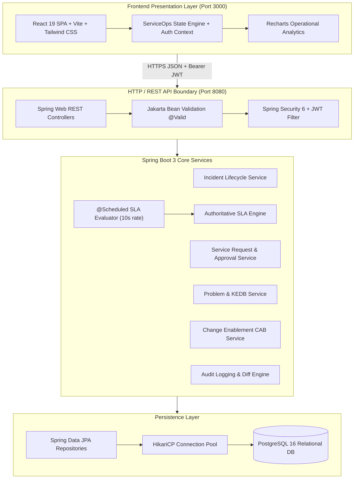

# ServiceOps - System Architecture & Technical Specifications

## 1. System Overview
ServiceOps is an internal IT Service Management (ITSM) and technical support platform built in alignment with ITIL v4 practices. It streamlines end-to-end incident lifecycles, service catalog fulfillment, authoritative SLA compliance, problem root-cause tracking, and change enablement (CAB).

## 2. Architecture Diagram

## 3. Layered Separation of Concerns
1. **Controller Layer (`com.serviceops.controller`)**:
   - Accepts incoming HTTP payloads.
   - Triggers declarative `@Valid` constraint validation.
   - Extracts authenticated `UserPrincipal` identity from the security context.
   - Encapsulates domain logic strictly within service layer calls.
   - Returns typed DTO responses wrapped in `ResponseEntity<T>`.

2. **Service Layer (`com.serviceops.service`)**:
   - Manages transactional boundaries (`@Transactional`).
   - Implements ITIL lifecycle state transitions (e.g. `NEW -> ASSIGNED -> IN_PROGRESS -> PENDING -> RESOLVED -> CLOSED`).
   - Executes deterministic calculations (Priority Matrix calculation based on Impact and Urgency).
   - Enforces business rules (mandatory resolution notes upon ticket resolution, preventing employees from posting internal work notes).

3. **Data Access Layer (`com.serviceops.repository`)**:
   - Spring Data JPA repositories with custom JPQL queries.
   - Uses indexing on `incident_number`, `status`, `priority`, and `requester_id` for $O(\log n)$ lookup performance.

4. **Background Scheduled SLA Processor**:
   - Runs every 10 seconds via `@Scheduled`.
   - Iterates over active incidents (`status NOT IN ('RESOLVED', 'CLOSED', 'CANCELLED')`).
   - Compares UTC timestamps against authoritative `response_deadline` and `resolution_deadline`.
   - Authoritatively triggers `BREACHED` or `AT_RISK` states without relying on client-side timers.

## 4. Role-Based Access Control (RBAC)
- **`EMPLOYEE`**: Submit incidents and service requests; view own tickets; confirm ticket resolution; browse published knowledge base articles.
- **`SERVICE_AGENT`**: Triage queues; self-assign incidents; author yellow-badge internal work notes; diagnose problems; view CMDB assets.
- **`SERVICE_MANAGER`**: Reassign team tickets; approve/reject service requests and CAB normal changes; inspect operational SLA compliance metrics and MTTR/MTTA.
- **`ADMIN`**: User role configuration; SLA policy target calibration; CMDB asset creation; database maintenance.
