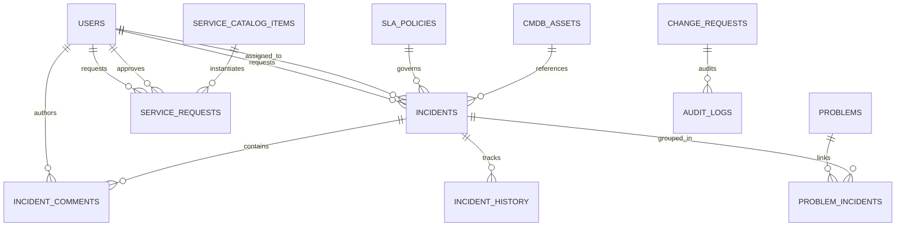

# ServiceOps - Database Design & Data Modeling

## 1. Relational Database Selection
PostgreSQL 16 was selected due to its robust ACID compliance, support for strict relational integrity constraints, foreign key cascades, and high-performance B-tree indexing. ITSM platforms cannot risk partial writes where an incident is created without an associated SLA deadline or where ticket numbers conflict under concurrent submission.

## 2. Entity-Relationship Model (ERD)

## 3. Key Relational Tables & Constraints
- **`users`**: UUID primary key, unique indexed `email`, BCrypt-hashed credentials, role enum constraint.
- **`incidents`**: Foreign keys to `users(requester_id)` and `users(assigned_agent_id)`. Includes an optimistic locking `@Version BIGINT version` column to prevent lost updates when multiple agents update a ticket concurrently.
- **`sla_policies`**: Priority primary key (`P1`, `P2`, `P3`, `P4`) storing response and resolution targets in minutes, plus business hours flags.
- **`incident_comments`**: Differentiates between public user communication (`is_internal_work_note = FALSE`) and agent-only technical discussions (`is_internal_work_note = TRUE`).
- **`service_requests`**: Stores dynamic custom form inputs as JSON and tracks multi-tier manager authorizations (`approval_status`).
- **`problems` & `problem_incidents`**: Normalized join table linking multiple recurring incidents to one underlying root-cause problem investigation.
- **`cmdb_assets`**: Configuration items (laptops, servers, switches) referenced by incidents to compute CI failure rates.
- **`audit_logs`**: Append-only log recording actor, entity, action, before-value, and after-value.

## 4. Indexing Strategy
- B-Tree indexes on all foreign key columns (`requester_id`, `assigned_agent_id`, `catalog_item_id`).
- Unique indexes on business identifiers: `incident_number`, `request_number`, `problem_number`, `change_number`, `asset_tag`.
- Composite index on `(resolution_deadline, status)` to optimize the background SLA calculation query that scans active tickets every 10 seconds.
